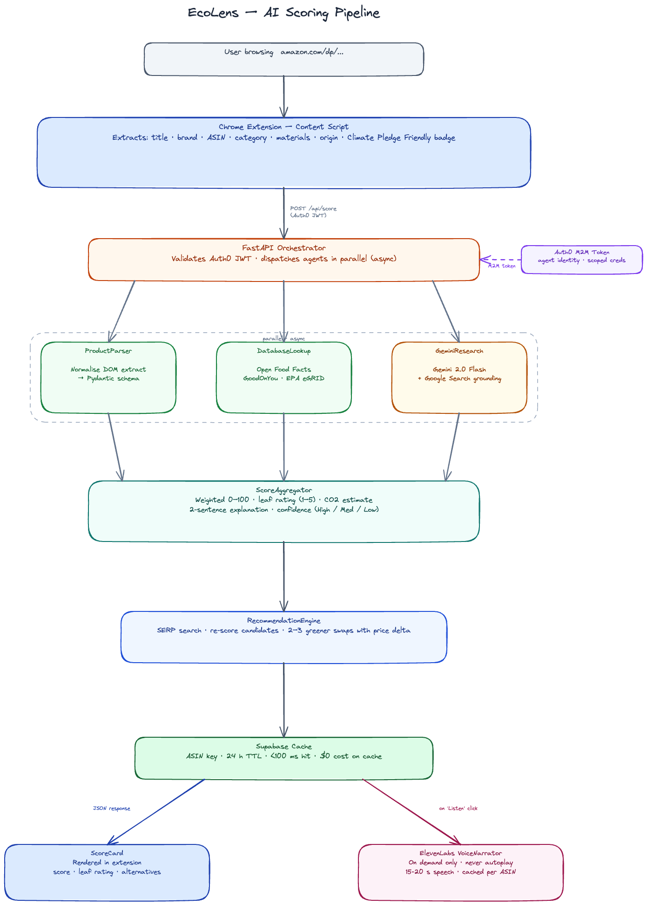

# EcoLens

**Know what you're really buying.**

EcoLens is a Chrome extension that activates on Amazon product pages and gives you an AI-generated sustainability score in under 5 seconds — carbon footprint, packaging waste, brand ethics, certifications — before you decide to buy. A companion web dashboard tracks your cumulative impact over time.

---

## The Problem

Amazon processes over 1.6 billion purchases every year. The average household's online shopping generates roughly 1.2 tonnes of CO₂ annually — and nearly all of that happens without the buyer ever knowing. At the moment of decision — the second your cursor is over "Add to Cart" — you have zero environmental information.

Sustainable consumption is an information problem. EcoLens solves it at the point of purchase, where it actually matters.

---

## Getting Started

### Prerequisites

- Node.js 20+, Python 3.11+, Chrome
- Supabase project, Auth0 app (regular web + M2M), API keys for Gemini, ElevenLabs, SerpAPI

```bash
cp .env.example .env.local
```

### 1. Supabase

```bash
supabase db push
# or paste migrations manually:
#   supabase/migrations/20260404000000_initial_schema.sql
#   supabase/migrations/20260404000001_decisions_table.sql
```

Seed demo data:
```bash
cd backend && python seed/seed_demo_data.py
```

### 2. Backend — FastAPI

```bash
cd backend
python -m venv venv && source venv/bin/activate
pip install -r requirements.txt
uvicorn main:app --reload --port 8000
```

### 3. Chrome Extension

```bash
cd extension && npm install && npm run dev
```

Go to `chrome://extensions` → Enable **Developer mode** → **Load unpacked** → select `extension/build/chrome-mv3-dev`.

### 4. Dashboard — Next.js

```bash
cd dashboard && npm install && npm run dev
```

Set `AUTH0_BASE_URL=http://localhost:3000` in `.env.local`.

---

## Architecture



Three agents fire in parallel per scan: **ProductParser** normalises DOM data, **DatabaseLookup** checks Open Food Facts and GoodOnYou, **GeminiResearch** pulls live brand data via Google Search grounding. **ScoreAggregator** synthesises a weighted 0–100 score, **RecommendationEngine** surfaces greener alternatives, and results are cached in Supabase by ASIN for 24 hours.

### Scoring dimensions

| Dimension | Weight | Data sources |
|---|---|---|
| Carbon Footprint | 30% | Gemini research + EPA eGRID + material analysis |
| Brand Ethics | 25% | GoodOnYou index + Gemini web research |
| Packaging | 20% | Review sentiment + product listing + Gemini |
| Certifications | 15% | DOM scrape (Climate Pledge Friendly, organic, etc.) |
| Durability | 10% | Category norms + review analysis |

Cache hit = <100ms response at $0 cost.

---

## Features

**Score Card** — floating card on any `amazon.com/dp/*` page with leaf rating, dimension breakdown, confidence, and 2–3 greener alternatives.

**Search Badges** — coloured leaf badge injected next to every product on search results pages.

**Cart Scanner** — scores every item in your cart, shows aggregate CO₂, flags the worst offender.

**Slow Cart** — for products scoring below 50, intercepts "Add to Cart" with a 3-second pause showing CO₂ cost and a greener swap.

**Voice Briefing** — ElevenLabs narrates a 20-second sustainability summary on demand, cached per ASIN.

**Order History Audit** — batch-scores past orders to show total CO₂ from recent purchases.

**Impact Dashboard** — Next.js app tracking cumulative CO₂ avoided, scan history, verdicts, and sustainability streak.

---

## Technology

**Gemini 2.0 Flash** — three agent calls per scan with Google Search grounding for real-time, verifiable sustainability data. Three API keys rotate across agents to stay within free-tier limits.

**ElevenLabs** — on-demand TTS via `/v1/text-to-speech`. Warm, conversational tone. Audio stored in Supabase Storage, keyed by ASIN.

**Auth0** — Google SSO + email login for users. A separate M2M credential signs every AI agent call with scoped permissions (`read:products`, `invoke:llm`, `write:scores`, `invoke:voice`) — agent identity is auditable and separate from user identity.

**Supabase** — PostgreSQL for scan history and score cache, Storage for audio files, row-level security per user.

**Plasmo** — Chrome extension scaffolding (React + TypeScript, Manifest V3). Six content scripts cover product pages, search results, cart, checkout, and order history.

---

## Impact at Scale

| Users | Decisions / month | CO₂ avoided / year |
|---|---|---|
| 1,000 | ~15,000 | ~43 tonnes |
| 100,000 | ~1.5M | ~4,320 tonnes |
| 1,000,000 | ~15M | ~43,200 tonnes |

CO₂ avoided from a skipped purchase is real and attributable — a direct consequence of a captured decision, not an estimate from page views.

---

## Repo Structure

```
├── backend/               # FastAPI — AI orchestration pipeline
│   ├── agents/            # ProductParser, GeminiResearch, ScoreAggregator, etc.
│   ├── auth/              # Auth0 JWT validation + M2M token management
│   ├── cache/             # Supabase score cache layer
│   ├── models/            # Pydantic schemas
│   ├── prompts/           # LLM system prompts
│   ├── voice/             # ElevenLabs integration
│   └── seed/              # Demo data seeder
├── extension/             # Plasmo Chrome extension
│   └── src/
│       ├── contents/      # Content scripts (product, search, cart, orders)
│       ├── components/    # ScoreCard, ScoreBar, LeafRating
│       └── lib/           # API client, DOM extractor
├── dashboard/             # Next.js web dashboard
│   └── src/
│       ├── app/           # App Router pages + layout
│       ├── components/    # ProductTable, AccessibilityFAB
│       └── lib/           # Auth0 + Supabase clients
└── supabase/
    └── migrations/        # SQL schema — apply in order
```

---

## Environment Variables

```
AUTH0_DOMAIN
AUTH0_CLIENT_ID / AUTH0_CLIENT_SECRET
AUTH0_M2M_CLIENT_ID / AUTH0_M2M_CLIENT_SECRET
GEMINI_API_KEY_1 / _2 / _3
ELEVENLABS_API_KEY / ELEVENLABS_VOICE_ID
SUPABASE_URL / SUPABASE_ANON_KEY / SUPABASE_SERVICE_ROLE_KEY
SERP_API_KEY
NEXT_PUBLIC_API_URL
```

Full descriptions are in `.env.example`.

---

## Running Tests

```bash
cd backend && pytest tests/ -v
```
